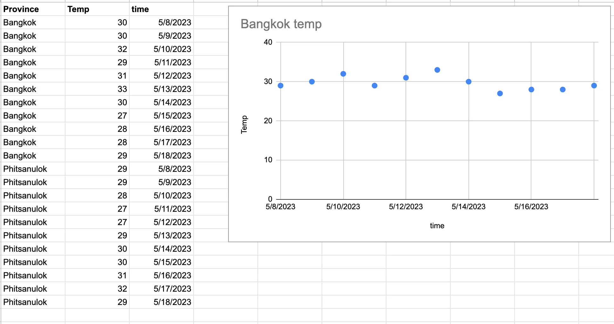
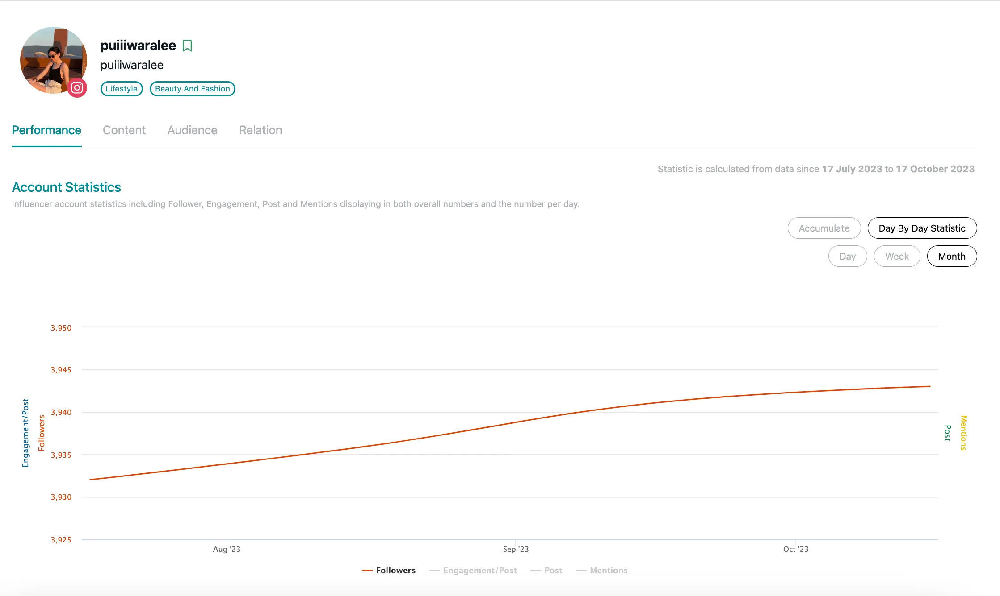
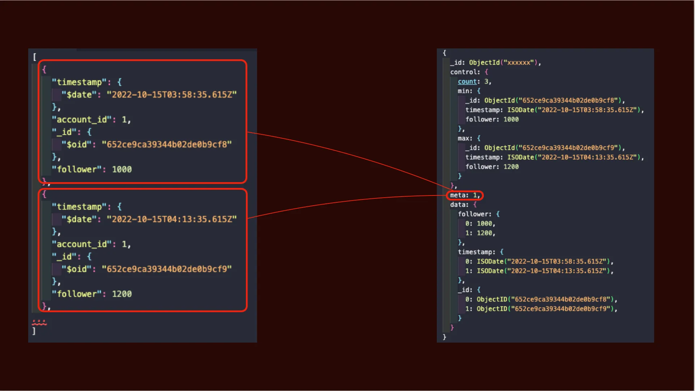
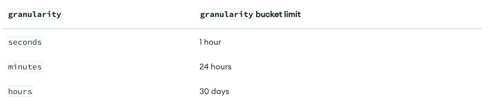
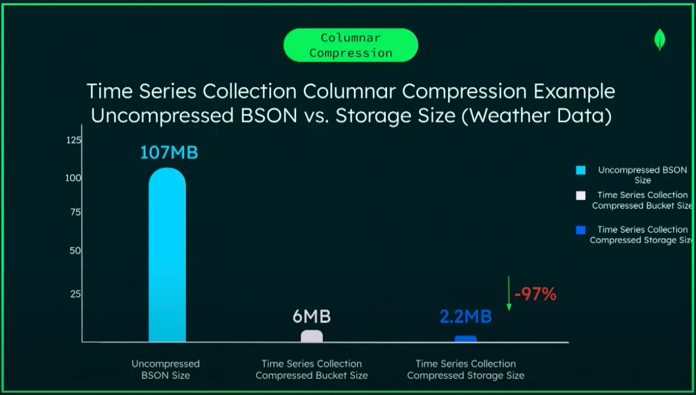
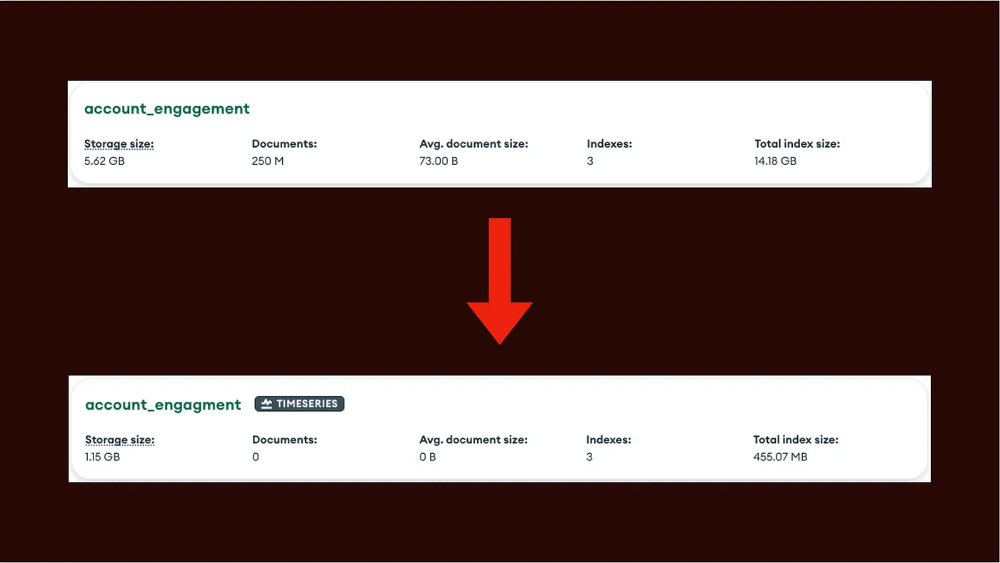

# MongoDB Time Series Collection

บทความนี้จะเป็นการแนะนำการใช้งาน Time series collection ใน MongoDB ครับ โดยก่อนที่เราจะไปใช้งาน Time series collection ของ MongoDB เราควรจะเริ่มจากรู้จัก Time series data กันก่อน

## Time Series Data คืออะไร

ข้อมูลที่เป็น Time-series คือข้อมูลของสิ่งๆนึงที่มีการบันทึกการเปลี่ยนแปลงของแต่ละช่วงเวลา ซึ่งตัวอย่างของข้อมูลที่เป็น Time-series ก็จะมีหลายๆอย่างเช่น ข้อมูลสภาพอากาศ ข้อมูลจาก Sensor ในตู้แช่, ข้อมูลตลาดหุ้น หรือ แม้แต่ข้อมูลการเงินเข้าออกในบัญชีธนาคารของเราก็เป็น time-series ทั้งนั้น

### ตัวอย่างข้อมูลสภาพอากาศ



จากตัวอย่างจะเห็นว่าเราสามารถเอาข้อมูลนี้มา Visualize การเปลี่ยนแปลงของอุณหภูมิตามแต่ละจังหวัดได้ ซึ่งจากตัวอย่างนี้จะเห็นว่าการเข้ามาของข้อมูลจะเป็นรายวันแต่ในชีวิตจริงข้อมูลพวกนี้จะมีความถี่ที่มากกว่านี้มาก ยกตัวอย่างข้อมูลตลาดหุ้นที่จะมีการเปลี่ยนแปลงไปในระดับวินาที ซึ่งทำให้ข้อมูลพวกนี้มีขนาดใหญ่มาก ดังนั้นการเลือกใช้ Database ให้เหมาะกับข้อมูลแต่ละประเภทจึงเป็นเรื่องสำคัญมาก

## วิธีที่ MongoDB จัดการกับ Time-series data

MongoDB เพิ่ม Feature time-series Collection มาใน MongoDB 5 ซึ่งผมก็มีโอกาสได้ลอง POC เพื่อจะนำไปใช้กับงานจริงอยู่ด้วย ก่อนอื่นจะขอเล่า Usecase คร่าวๆก่อน ซึ่งจะขอยกตัวอย่างเป็น Feature นึงใน Product ของ WISESIGHT ที่ชื่อว่า Influencer Directory



Influencer Directory เป็นหนึ่งใน Product ที่ใช้ในการ Visualized performance ต่างๆของ Influencer โดยในรูปข้างบนจะเป็นการ Visualized ค่า Follower ของ Influencer เป็นรายเดือน ซึ่งตัว Data คร่าวๆจะเป็นประมาณนี้

```json
[
  {
    "timestamp": {
      "$date": "2022-10-15T03:58:35.615Z"
    },
    "account_id": 1,
    "_id": {
      "$oid": "652ce9ca39344b02de0b9cf8"
    },
    "follower": 1000
  },
  {
    "timestamp": {
      "$date": "2022-10-15T04:13:35.615Z"
    },
    "account_id": 1,
    "_id": {
      "$oid": "652ce9ca39344b02de0b9cf9"
    },
    "follower": 1200
  }
...
]
```

โดยใน 1 Doc ของเราจะมี Fields ดังนี้

- timestamp : มี Type เป็น Date
- account_id : มี Type เป็น Int
- follower : มี Type เป็น Int
- _id : มี Type เป็น ObjectID

โดยตัว Fields ที่อยากให้สนใจเป็นพิเศษก็คือ timestamp และ account_id

ใน MongoDB **เราจะเรียก account_id ว่าเป็น metaField และ timestamp ว่าเป็น timeField** ซึ่ง 2 Fields นี้จะเป็น Fields ที่ช่วยให้ MongoDB รู้ได้ว่าต้องการจัดการ Time Series data ของเรายังไง


### ทำการสร้าง Time-series Collection

เราสามารถสร้าง time-series collection ได้โดยใช้คำสั่ง **createCollection**

```javascript
db.createCollection(
"accounts_follower",
{
  timeseries: {
    timeField: "timestamp",
    metaField: "account_id",
    granularity: "minutes"
  }
})
```

จากคำสั่งในการสร้าง Collection ข้างต้นจะเห็นว่าเรามีใส่ Options ของ timeseries เข้าไปเพิ่ม โดย effect ของ options แต่ละตัวจะช่วยให้ MongoDB จัดการ Documents ของเราในรูปของ **Bucket** ได้ดีขึ้น

เวลาที่เราสร้าง Collection แบบ Time-series ตัว MongoDB จะไม่ได้เก็บ Documents ของเราแบบปกติเหมือน Collection ปกติ แต่จะมาเก็บข้อมูลเป็น Bucket แทนเพื่อช่วย Optimized Read Performance และ Optimized Storage และ Index sized ลงไปด้วย โดยหน้าตาของ Bucket จะเป็นดังรูปด้านล่าง



จากรูปจะเห็นว่าพอเรามีการ Insert Docs เข้าไป MongoDB จะทำการเอา Docs ของ Account ID : 1 ไปเก็บไว้ใน Bucket โดย granularity ที่เราได้ทำการตั้งไปว่าเป็น minutes นั้นแปลว่าข้อมูลจะเข้ามาในหลักนาที โดยขนาดของ Bucket จะมีขนาดใหญ่หรือเล็กขึ้นอยู่กับค่า Granularity ที่เราตั้งไป ตามรูปด้านล่าง



นอกจากการ Set Granularity แล้ว เรายังกำหนด Bucket Size ได้เองโดยการใช้ **bucketMaxSpanSeconds และ bucketRoundingSeconds แทนการใช้ Granularity ก็ได้**

```javascript
db. createCollection(
   "account_follower",
   {
      timeseries: {
         timeField: "timestamp",
         metaField: "account_id",
         bucketMaxSpanSeconds: 300,
         bucketRoundingSeconds: 300
      }
   }
)
```

โดยจากตัวอย่าง อันนี้คือเราจะให้ขนาด Bucket เก็บข้อมูลแค่ 300 วิเท่านั้น

ย้อนกลับไปที่ Bucket Structure เราจะสังเกตุเห็นว่าตอน MongoDB เก็บข้อมูลลง Bucket จะมีการแยก Fields ต่างๆออกมา นี้ก็เป็นรูปแบบของการเก็บข้อมูลแบบ Columnar หรือ Column Based ซึ่งสิ่งนี้จะช่วยให้การอ่านข้อมูลทำได้ไวกว่าการเก็บแบบ Row Based

การเก็บข้อมูลแบบ Bucket นี้จะช่วยลดพื่นที่ลงไปได้อีกด้วย



จากการ POC ผมได้ลอง Feed mocking data เข้าไปจำนวน 250 ล้าน Documents ซึ่งขนาดที่ใช้ในการเก็บก็ลดลงเยอะมาก จาก Collection ปกติใช้ไป 5.6GB แต่พอเป็น Time-series Collection ใช้ไปเพียง 1.15GB



ทั้งนี้นอกจากขนาดของ Docs ที่ลดลงแล้วขนาดของ Index ก็ลดลงตามไปด้วย จาก 14GB เหลือเพียง 155 MB

## ลอง Query ข้อมูล

ผมได้ลองทำการ Query ข้อมูลตาม Usercase ต่างๆของ Time-series data ดังนี้

1. Query เอาข้อมูลของ Account ID : 1 มาแสดง Follower รายวันเพื่อ Plot graph

```javascript
[
  {
    $match: {
      account_id: 1,
      timestamp: {
        $gte: new Date(
          "2022-10-15T03:58:35.615+00:00"
        ),
        $lte: new Date(
          "2023-01-15T03:58:35.615+00:00"
        ),
      },
    },
  },
  {
    $project: {
      date: {
        $dateToString: {
          date: "$timestamp",
          format: "%Y-%m-%d",
        },
      },
      follower: 1,
    },
  },
  {
    $group: {
      _id: "$date",
      maxfollower: {
        $max: "$follower",
      },
    },
  },
  {
    $sort: {
      date: 1,
    },
  },
  {
    $limit: 10,
  },
  {
    $project: {
      date: "$_id",
      maxfollower: 1,
      _id: 0,
    },
  },
]
```

ตัวอย่างผลลัพธ์

```json
[{
  "maxFollower": 9936134,
  "date": "2023-01-07"
},
{
  "maxFollower": 9967338,
  "date": "2022-12-07"
},
{
  "maxFollower": 9988506,
  "date": "2022-11-28"
},
{
  "maxFollower": 9574683,
  "date": "2022-11-22"
},
{
  "maxFollower": 9940951,
  "date": "2022-12-12"
},
{
  "maxFollower": 9914847,
  "date": "2022-11-09"
},
{
  "maxFollower": 9957221,
  "date": "2022-11-29"
},
{
  "maxFollower": 9850344,
  "date": "2022-11-27"
},
{
  "maxFollower": 9910238,
  "date": "2022-12-01"
},
{
  "maxFollower": 9987057,
  "date": "2023-01-03"
}]
```

2. Query หาข้อมูลของ Account ที่มียอด Follower สูงสุดในช่วงเวลานั้นๆ

```javascript
[
  {
    $match: {
      timestamp: {
        $gte: new Date(
          "2022-10-15T03:58:35.615+00:00"
        ),
      },
    },
  },
  {
    $group: {
      _id: "$account_id",
      avgFollower: { $avg: "$Follower" },
    },
  },
  {
    $sort: { avgFollower: -1 },
  },
  {
    $limit: 10,
  },
]
```

ตัวอย่างผลลัพธ์

```json
[{
  "avgFollower": 9936134,
  "date": "2023-01-07"
},
{
  "avgFollower": 9967338,
  "date": "2022-12-07"
},
{
  "avgFollower": 9988506,
  "date": "2022-11-28"
},
{
  "avgFollower": 9574683,
  "date": "2022-11-22"
},
{
  "avgFollower": 9940951,
  "date": "2022-12-12"
},
{
  "avgFollower": 9914847,
  "date": "2022-11-09"
},
{
  "avgFollower": 9957221,
  "date": "2022-11-29"
},
{
  "avgFollower": 9850344,
  "date": "2022-11-27"
},
{
  "avgFollower": 9910238,
  "date": "2022-12-01"
},
{
  "avgFollower": 9987057,
  "date": "2023-01-03"
}]
```

## ส่งท้าย

นอกจากการ Set ค่าต่างตอนสร้าง Time-series collection แล้ว เรายังสร้างสามารถตั้ง Time-to-live ให้กับข้อมูลของเราด้วย เนื่องจากข้อมูล Time-series หากเก็บไปเรื่อยจะมีขนาดเพิ่มขึ้นเรื่อยแต่โดยปกติเวลาเรา Work กับข้อมูลประเภทนี้เรามีจะ Work กับแค่ช่วงเวลานึงเท่านั้น ดังนั้นหากต้องลบข้อมูลเราสามารถใช้ **TTL Index** ในการให้ MongoDB ลบข้อมูลได้เองด้วย ดังนี้

```javascript
db.createCollection(
    "account_follower",
    {
       timeseries: {
          timeField: "timestamp",
          metaField: "account_id",
          granularity: "minutes"
       },
       expireAfterSeconds: 2592000
    }
)
```

นอกจากนี้หากเราต้องการทำ **Sharding** บน Time-series collection เพื่อรองรับการทำ Horizontal Scale ก็สามารถทำได้เช่นกันโดยใช้คำสั่ง ShardCollection

```javascript
sh.shardCollection(
   "poc.account_follower",
   { "account_id": 1 },
   {
      timeseries: {
         timeField: "timestamp",
         metaField: "account_id",
         granularity: "minutes"
      }
   }
)
```

## สรุป

หากเรามีข้อมูลที่เป็น Time-series ควรเลือกวิธีที่เก็บข้อมูลให้ถูกต้อง ซึ่ง MongoDB มี Time-series Collection ตั้งแต่ MongoDB version 5 เป็นต้นไป โดย MongoDB จะเก็บข้อมูลเป็น Bucket เพื่อ Optimized IO Operation และ Storage Size

## Ref.

- [https://www.youtube.com/watch?v=LVnW2ozEmFc&ab_channel=MongoDB](https://www.youtube.com/watch?v=LVnW2ozEmFc&ab_channel=MongoDB)

- [https://www.mongodb.com/docs/manual/core/timeseries-collections/](https://www.mongodb.com/docs/manual/core/timeseries-collections/)

- [https://medium.com/p/7351ba093f4e](https://medium.com/p/7351ba093f4e)