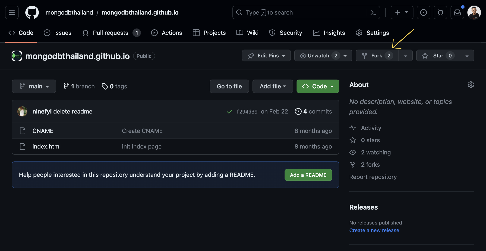

ขั้นตอนหลักๆ ในการเขียนและส่งคอนเทนต์เข้าสู่ MongoDB Thailand มีขั้นตอนหลักๆ ดังนี้

1. **Fork โปรเจกต์**ไปเป็นของคุณเอง
2. **Clone โปรเจกต์**ลงในเครื่องของคุณ
3. **ติดตั้ง Dependency** ที่จำเป็นในการเขียน
4. **เริ่มลงมือเขียน** และดูตัวอย่าง
5. **Commit และ push** เนื้อหาหรือโค้ดที่เขียนเข้าไปใน Git
6. **เปิด pull request** เพื่อส่งเนื้อหาเข้าสู่ repository กลาง
7. **เสร็จเรียบร้อย** เราก็เท่ซะด้วย ไม่ต้องลำบากว้าวุ่นเลย

## (1) Fork โปรเจกต์

เข้าไปที่ [repository ของ mongodbthailand.github.io](https://github.com/mongodbthailand/mongodbthailand.github.io)
จากนั้น**กดปุ่ม Fork** ด้านขวาบน

**(ช่วงนี้เข้าไปแล้วอาจจะเจอหน้าว่างเป็นบางครั้ง ลองกด refresh สัก 1 ที)**



จากนั้น GitHub จะให้ระบุเจ้าของ repository และชื่อ repository ในที่นี้ให้เลือกเจ้าของเป็นแอคเคานต์ของคุณเอง
ส่วนชื่อ repository จะเปลี่ยนหรือไม่ก็ได้ตามสะดวก เสร็จแล้ว**กดปุ่ม Create fork**


รอสักครู่ เสร็จเรียบร้อยแล้วจะมี repository ที่มีโค้ดเหมือนกัน ปรากฎเป็น repository ของคุณแล้ว

## (2) Clone โปรเจกต์

จากหน้า repository ของคุณเอง ให้**กดที่ปุ่ม Code** จากนั้นเลือก clone โค้ดนี้มายังเครื่องของคุณ


## (3) ติดตั้ง Dependency

เพื่อดูหน้าตาของเว็บไซต์ที่คุณจะแก้ไข จำเป็นต้องทำดังนี้

- [ติดตั้ง NodeJS](https://nodejs.dev/en/)
- เปิด terminal ไปที่โฟลเดอร์โปรเจกต์ที่ clone มา แล้วสั่ง `npm install` เพื่อติดตั้ง

เมื่อติดตั้งเสร็จแล้ว สามารถสั่งคำสั่ง `npm run dev` เพื่อเปิดเว็บเซิฟเวอร์ทดสอบในเครื่องของท่าน
โดยเว็บจะเปิดให้ทดลองเข้าได้จาก [http://localhost:4321](http://localhost:4321)

## (4) เริ่มลงมือเขียน

คุณสามารถเขียนเนื้อหาได้ โดยสร้างไฟล์ Markdown (นามสกุล `.md`) ภายใต้โฟลเดอร์ `/src/content/docs/guides`
และเริ่มต้นเขียน โดยคัดลอกเนื้อหานี้ไปใช้เป็นเทมเพลตตั้งต้นได้เลย

```mdx
---
title: ชื่อบทความ
description: คำโปรยของบทความ
---

เริ่มเขียนเนื้อหาได้ที่นี่เลย สำหรับเนื้อหาตัวอย่างนี้สามารถลบออกได้

โปรดสังเกตว่าการขึ้นย่อหน้าใหม่ ให้เว้นบรรทัดว่าง 1 บรรทัด

## ตัวอย่างหัวข้อรอง

กรณีต้องการแบ่งหัวข้อในเนื้อหา สามารถใช้เครื่องหมายสี่เหลี่ยมสองอันนำหน้า เพื่อเป็นหัวข้อรองได้
```

หากสร้างไฟล์และเนื้อหาถูกฟอร์แมต จะมีบทความของท่านปรากฎในเมนูด้านซ้าย ให้คุณสามารถกดเข้าไปดูได้
โดยหน้าพรีวิวนี้จะอัปเดตทุกครั้งที่ท่านเซฟไฟล์

## (5) Commit และ push

เมื่อเขียนและแก้ไขจนพอใจแล้ว ให้คุณ commit และ push เนื้อหาที่เขียน ขึ้นมาเก็บไว้บน repository ของคุณ

## (6) เปิด pull request

เมื่อพร้อมแล้ว คุณสามารถเปิด pull request ได้ โดยไปที่หน้า repository ของคุณ
ด้านบนรายชื่อไฟล์ จะมีแถบบอกสถานะ ให้กดที่ปุ่ม **Contribute** แล้วกดปุ่ม **Open pull request**


จากนั้น ตั้งชื่อและระบุรายละเอียดเบื้องต้นว่า เป็นความเปลี่ยนแปลงเกี่ยวกับอะไร จากนั้นกดปุ่ม Create

หลังจากสร้างแล้ว จะปรากฎ pull request เพื่อให้ทาง MongoDB Thailand Community ช่วยตรวจสอบ
ให้คุณติดตามสถานะ และสนทนากันใน pull request นั้นได้เลย

## (7) เสร็จเรียบร้อย

เมื่อ Pull request ได้รับการตอบรับแล้วก็เป็นอันเรียบร้อย! เว็บไซต์จะได้รับการอัปเดต โดยมีเนื้อหาที่คุณร่วม
contribute อยู่บนนั้นเท่ๆ แล้ว เป็นอันว่าการ contribute ในโครงการโอเพนซอร์สของคุณสำเร็จแล้ว!

## คำแนะนำ

- ระหว่างที่คุณเปิด Pull request จะมีทีมงาน MongoDB Thailand Community ช่วยตรวจสอบเนื้อหาให้
หากจำเป็นต้องแก้ไข คุณสามารถแก้ไข แล้ว commit และ push ขึ้นมาได้ตามขั้นตอนเดิม โดยไม่ต้องเปิด pull request ใหม่
- ระหว่างที่คุณเขียน/แก้ไขบทความอยู่ อาจมีการแก้ไขโค้ดเพิ่มเติมจาก repository ต้นน้ำ
ดังนั้นก่อนเปิด pull request เราแนะนำให้คุณกดปุ่ม **Sync fork** เพื่ออัปเดตข้อมูลล่าสุดก่อน
